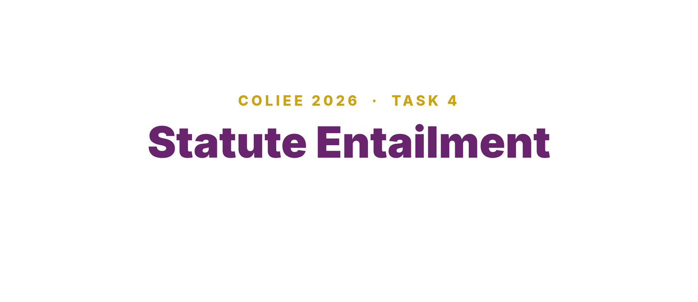
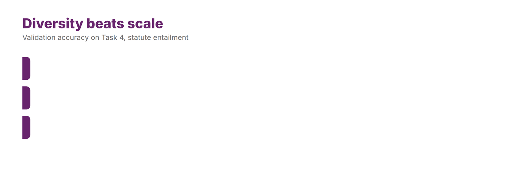

# Team DU at COLIEE 2026

[](LICENSE)
[](https://coliee.org/COLIEE2026/overview)


**First place in Task 4, statute entailment, with 96.3% accuracy.** This repository holds Durham University's code for all five tasks of the 2026 Competition on Legal Information Extraction and Entailment (COLIEE), held alongside the [21st International Conference on Artificial Intelligence and Law (ICAIL 2026)](https://site.smu.edu.sg/icail-2026) in Singapore. The work is described in our paper, *Cross-Architecture LLM Ensembles, Feature-Based Reranking and Retrieval-Augmented Prompting for Legal Information Processing*.

The single idea running through the five tasks is that no one method wins everywhere. Different legal tasks reward different inductive biases. A cross-architecture ensemble of open-weight language models won statute entailment outright. Long-document retrieval was carried by hand-built features rather than neural rerankers. On statute law a stronger model with clean retrieval beat a more elaborate pipeline. The competition rules permit only models whose weights are publicly available and forbid closed models such as GPT-4o and Gemini, so every system here uses open-weight models. We used no closed or frontier model at any point.

## The competition

COLIEE is the [Competition on Legal Information Extraction and Entailment](https://coliee.org/COLIEE2026/overview), an annual benchmark of legal case retrieval, statute retrieval, and legal entailment. The 2026 edition is held alongside the [21st International Conference on Artificial Intelligence and Law (ICAIL 2026)](https://site.smu.edu.sg/icail-2026), at the Yong Pung How School of Law, Singapore Management University, from 8 to 12 June 2026. ICAIL is organised under the International Association for Artificial Intelligence and Law, and this is the first time it has been held in Asia. COLIEE 2026 ran four shared tasks on case law and statute law, with a pilot task on tort prediction. We entered all of them.

## Results

| Task | What it is | Our best result | Official rank |
| --- | --- | --- | --- |
| 1 | Legal case retrieval | F1 0.314 | 11 of 54 runs |
| 2 | Legal case entailment | F1 0.343 official, 0.555 post-competition | 22 of 35 runs |
| 3 | Statute retrieval and entailment | 79.3% official, 91.5% post-competition | 14 of 22 runs |
| 4 | Statute entailment | 96.3% accuracy | 1st of 33 runs |
| Pilot | Legal judgment prediction (tort) | 73.1% tort accuracy, 68.2% rationale F1 | unofficial |

Task 4 is the headline. Both of our submitted runs reached 96.3% (79 of 82) on the unseen test set and took the top two places among 33 runs from 11 teams. The pilot entry was submitted under the wrong run mode and the organisers listed it as unofficial. Its tort accuracy is above every official entry and its rationale F1 matches the best.

The post-competition figures are improvements made after the deadline with no change to the system architecture. They are labelled as such throughout, and the full table with all runs is in [`docs/results.md`](docs/results.md).

## What we found

A single line of prompt mattered more than the model. On Task 2, changing the instruction from "select at most one paragraph" to "select all that entail" raised F1 by 0.212, past the best official entry, with nothing else altered.

On statute law, more pipeline made things worse. With retrieval recall already above 0.94, a stronger entailment model beat our more elaborate run by a wide margin, and the elaborate run itself lost 3.7 points to a simpler one.

The system that won one task lost another. The nine-expert ensemble that took first place on Task 4 is beaten by a single Qwen3-235B on Task 3, because the extra retrieved articles act as distractors that mislead the weaker members.

Diversity beat scale. On Task 4 the gain came from disagreement between model families, not from any single large model.

## The winning system

<p align="center"></p>

Nine open-weight experts from three families each return an independent yes or no, and a hierarchical meta-ensemble combines them. The experts differ in prompt as well as in model, from a plain instruction to chain-of-thought, the IRAC legal framework, and a word-by-word check, and that diversity of prompting is set out in [`task4-statute-entailment/prompts.md`](task4-statute-entailment/prompts.md). The case for diversity is clearest on the validation set, where a single model ensembled with itself plateaus well below the cross-architecture vote.

<p align="center"></p>

## Layout

```
task1-case-retrieval/      learning-to-rank over thirty-four features
task2-case-entailment/     retrieval, reranking, few-shot ensemble, prompt study
task3-statute-law/         character-bigram retrieval and statute entailment
task4-statute-entailment/  the nine-expert cross-architecture ensemble
pilot-tort-prediction/     five-view ensemble with a claim-to-verdict bridge
docs/                      results in full and the architecture-gap analysis
data/                      how to obtain the COLIEE data (the data is not included)
```

Each task folder has its own README with the method, the commands to reproduce the result, and the numbers a correct run should produce.

## Data

The COLIEE datasets are provided under an agreement with the competition organisers and cannot be redistributed here. See [`data/README.md`](data/README.md) for how to request the data and where to place it.

## Citing this work

If you use this code, please cite the paper. The reference is in [`CITATION.cff`](CITATION.cff), and GitHub will show a "Cite this repository" button. The paper is to appear in the COLIEE 2026 proceedings, and the full bibliographic details will be added here once they are published.

## Licence

MIT. See [`LICENSE`](LICENSE).

## Authors

Amal Saad Alshehri, Nelly Bencomo, and Amir Atapour-Abarghouei. Department of Computer Science, Durham University, United Kingdom.
