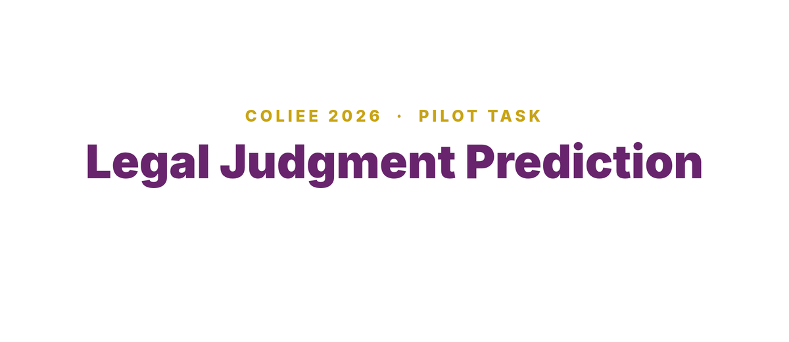

# Pilot Task, Legal Judgment Prediction

The pilot task works over Japanese tort cases. For each case the system predicts the court's decision and the rationale it accepted. Two scores are reported, tort accuracy for the decision and F1 for the rationale.

## Result

Our system reached a tort accuracy of 73.1%, correct on 587 of 803 cases, and a rationale F1 of 68.2%.

The entry was submitted under the wrong run mode, and the organisers listed it as unofficial. We report it here for completeness and are clear about its status. With that caveat stated, its tort accuracy is above every official entry, and its rationale F1 matches the best official figure.

## Method

The system reads each case through five views and combines them, then repairs the decision with a bridge from the claim level to the verdict.

1. **Five views.** Two joint BERT models trained from different seeds, a claim-only BERT, a retrieval view using nearest neighbours over learned embeddings, and a natural language inference view. Each view scores every claim in the case.
2. **Stacking.** A logistic-regression stacker learns a weight for each view by cross-validation. The retrieval view earns the largest weight.
3. **Verdict bridge.** A gradient-boosted model maps the claim-level predictions to the case verdict. Long cases are truncated at 512 tokens, which affects 41% of them, and the bridge recovers what truncation loses. It accounts for 2.8 points of the tort accuracy on its own.
4. **Coherence.** A small set of rules removes contradictions between the claims and the predicted verdict.

The contribution of the bridge is visible in the ablation. A single BERT reaches 70.9%, the five views without the bridge reach 70.5%, and the full system reaches 73.1%.

## Running it

The submitted system is the integrated solver in [`solver.py`](solver.py), with its support package in [`src/`](src). The solver loads the trained models, runs the five views, combines them with the stacker, applies the claim-to-verdict bridge, and makes the coherence repairs near the decision threshold. It implements the official LJPJT-26 task interface and is run through the task template, which provides each case as input.

The solver expects an `app.ini` configuration file and the trained model artefacts under `models/` to be present before it can be imported and run, alongside the case data as local inputs, all placed relative to the task folder. These come from the pilot data and from our own training, and are not included here.

This was an unofficial entry, as noted above. The many training scripts behind the individual views are part of our working tree and are not all reproduced here. Scripts from our exploration that called external services are left out, in keeping with the rest of this repository.

Dependencies are in [`requirements.txt`](requirements.txt).
